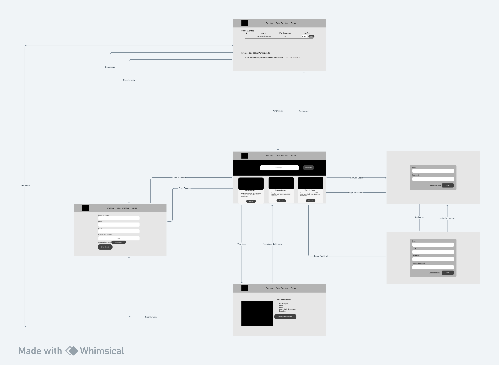
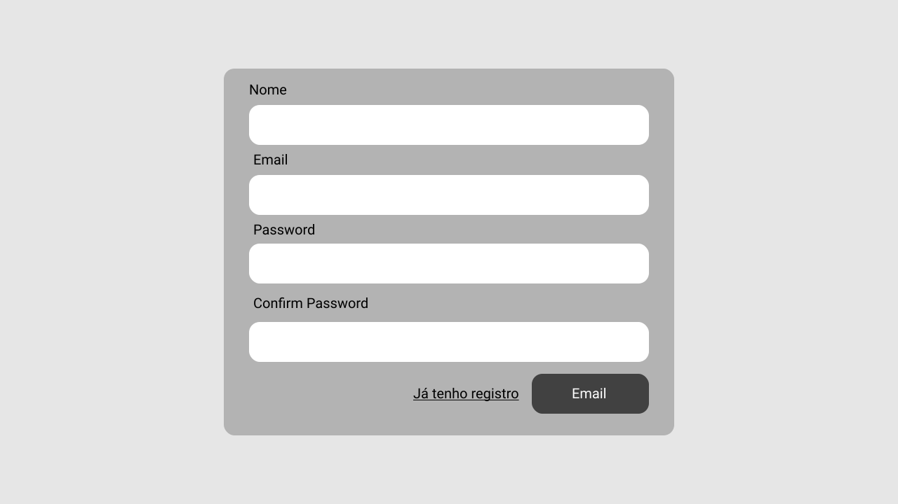
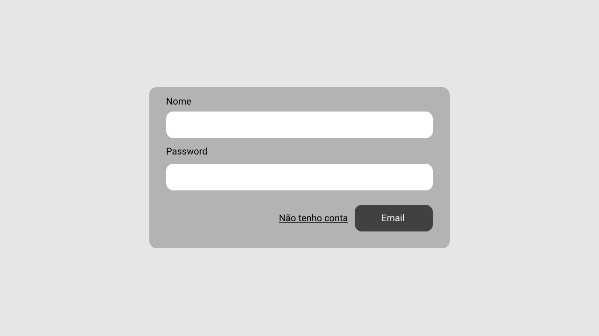
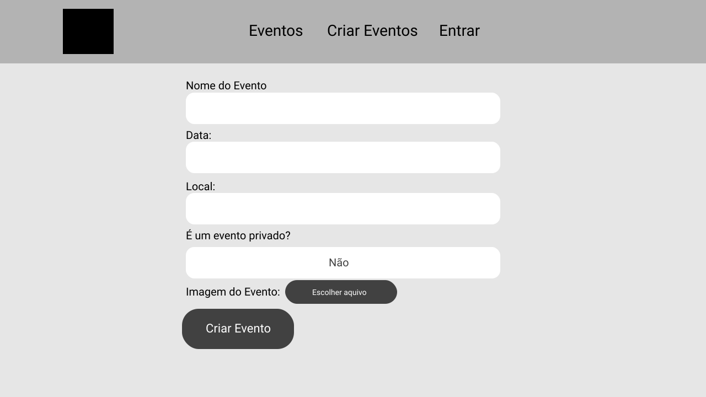

# Aplicações na Internet

## Minimundo

Um grupo de 4 amigos se juntou para criar uma Startup de eventos para todos os tipos de públicos, sendo esses eventos online e presenciais. A fonte de renda da empresa são os anúncios que estão na plataforma, não sendo cobrado para colocar eventos no site, e os eventos não precisam ser feitos por empresas, só precisam ser feitos pelos usuários cadastrados no site.

---

## Tecnologias 

- Docker
- TypeScript
- Node.JS
- React
- Bootstrap

---

## Ferramentas de documentação

- Figma
- Whimsical

---

## Diagrama de Navegabilidade

Você pode ver o diagrama melhor [Clicando aqui](https://whimsical.com/a1-aplicacoes-na-internet-5N2p2ibDLr4qS6VYoSk27h)

---

## Telas da aplicação

### Pagina Inicial

A página inicial será onde ficará exposto os eventos.

- O quadrado preto na *Navbar* é o logo da empresa(ainda a ser definido).

- O fundo preto atrás da pesquisa terá que ser um elemento *Parallax* do Bootstrap.

- A página terá um *Grid System* do Bootstrap com 3 colunas, onde os eventos será pegos do **Back-end** via API.

### Registro

- Tem que ser um *form* com *método HTTP Post*

### Login

- Tem que ser um *form* com *método HTTP Post*

### Dashboard sem Eventos

### Dashboard

- A *Div* **Eventos que estou Participando** terá uma *table* igual ao do **Meus Eventos**

### Crie seu Evento

- Tem que ser um *form* com *método HTTP Post*

### Descrição do Evento

---
