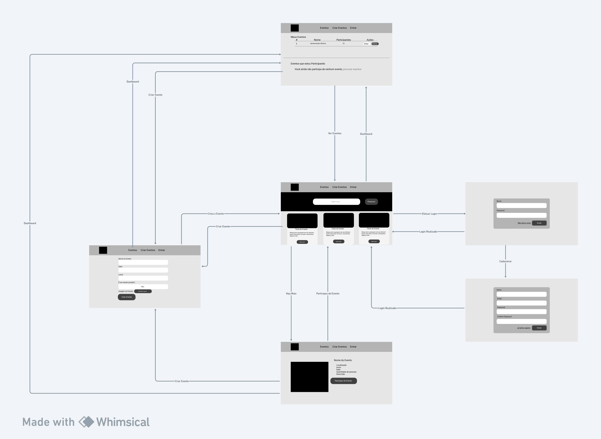
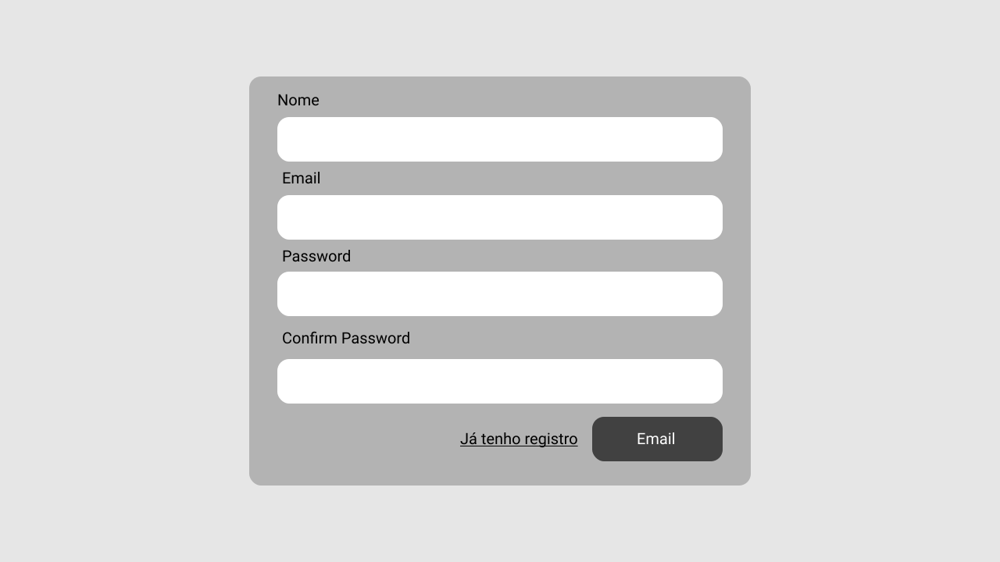
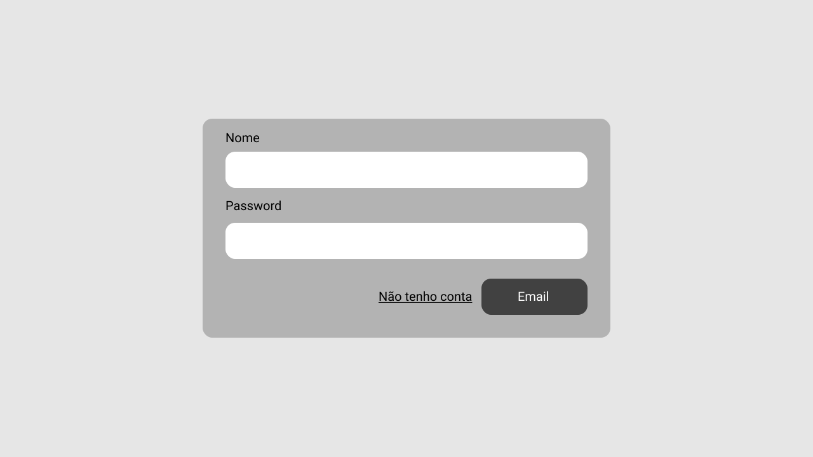
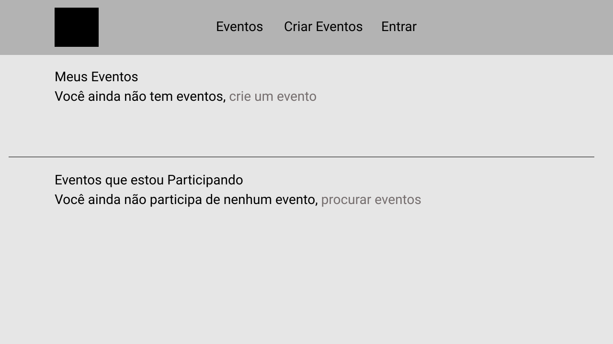
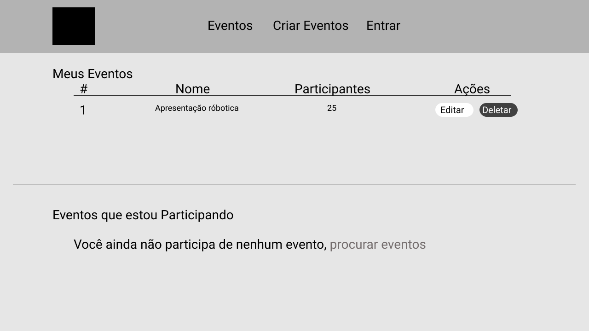
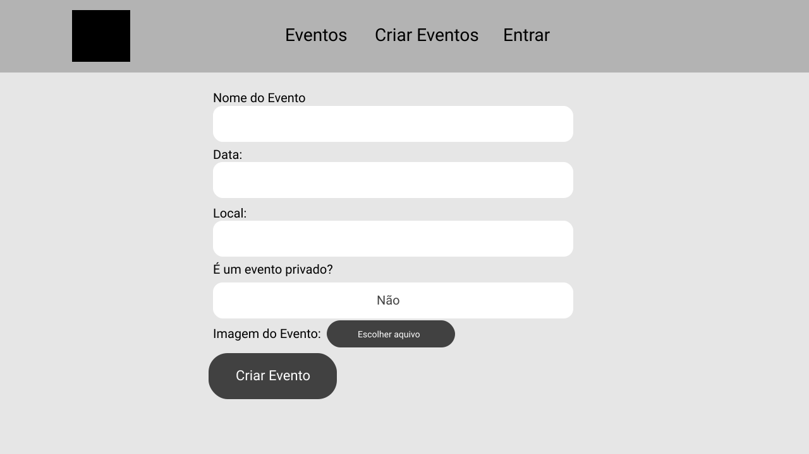
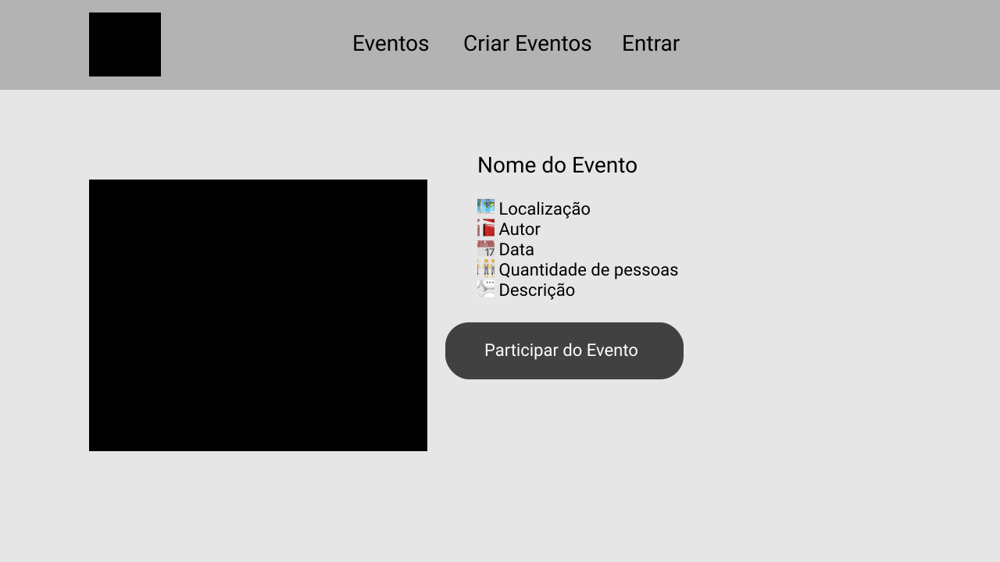

# Prototipação

## Diagrama de Navegabilidade

Você pode ver o diagrama melhor [Clicando aqui](https://whimsical.com/a1-aplicacoes-na-internet-5N2p2ibDLr4qS6VYoSk27h)

---

## Telas da aplicação

### Pagina Inicial

Você pode ver melhor as telas do evento [Clicando aqui](https://www.figma.com/file/AMb6NqrFlXpZQ2nmInx25k/A1_aplica%C3%A7%C3%B5es-na-internet?type=design&node-id=9%3A27&mode=design&t=rliAOO6vqf8c0NGC-1)

A página inicial será onde ficará exposto os eventos.

- O quadrado preto na *Navbar* é o logo da empresa(ainda a ser definido).

- O fundo preto atrás da pesquisa terá que ser um elemento *Carousel* do Bootstrap.

- A página terá um *Grid System* do Bootstrap com 3 colunas, onde os eventos será pegos do **Back-end** via API.

### Registro

- Tem que ser um *form* com *método HTTP Post*

### Login

- Tem que ser um *form* com *método HTTP GET*

### Dashboard sem Eventos

### Dashboard

- A *Div* **Eventos que estou Participando** terá uma *table* igual ao do **Meus Eventos**

### Crie seu Evento

- Tem que ser um *form* com *método HTTP Post*

### Descrição do Evento

---
